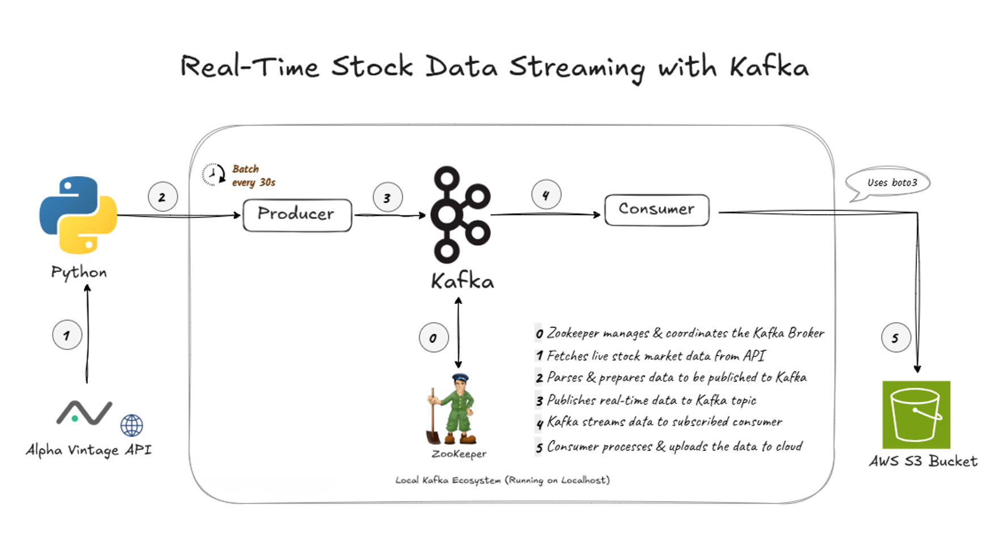

# 📈 Real-Time Stock Data Streaming with Kafka + AWS Cloud + Python

## 🚀 Project Overview

This project simulates **real-time stock price data streaming** using **Apache Kafka (locally installed)**. It fetches intraday stock data from a public API, publishes it to a Kafka topic, and consumes the messages to upload them as **Parquet files** into an **Amazon S3** bucket using `boto3`.

---

## 🔧 Architecture Diagram



This diagram illustrates the end-to-end flow of the real-time stock data processing pipeline.

---

## 🧰 Tech Stack

- **Language:** Python
- **Streaming Platform:** Apache Kafka (Local)
- **Cloud Storage:** AWS S3
 
 ---
 
## 📦 Libraries Used

Below are the key libraries and packages used in this project:

| Library                  | Purpose                                                                 |
|--------------------------|-------------------------------------------------------------------------|
| `kafka-python`           | To produce and consume messages from Kafka topics                      |
| `requests`               | For making HTTP requests if needed for APIs or services      |
| `boto3`                  | To interact with AWS services like S3                                   |
| `pandas`                 | For efficient data manipulation and transformation                      |
| `pyarrow`                | For handling columnar data structures and memory-efficient tables       |
| `pyarrow.parquet`        | To read/write Parquet files                                             |
| `json`                   | For parsing and generating JSON data                                    |
| `time`                   | To manage timestamps and execution delays                               |
| `io`                     | For handling in-memory file-like objects (e.g., `BytesIO`)              |
| `yaml`                   | To read and parse YAML configuration files                              |
| `os`                     | For interacting with the operating system (env vars, paths, etc.)       |
| `dotenv` (`python-dotenv`)| To load environment variables from `.env` files                         |
| `utils.config_loader`    | Custom module to load project-specific configurations (YAML/JSON)       |

---

## 📦 Project Structure

```
01-stock-data-streaming-kafka/
architecture/
│   └── real-time-stock-data-streaming-using-kafka.png
scripts/
│   └── producer.py                  # Streams stock data to Kafka
│   └── consumer.py                  # Consumes Kafka messages and writes to S3
│   └── utils/
│     └── config_loader.py           # Loads config from JSON
├── config/
│   └── app_config.yaml              # API, Kafka, and AWS configurations
└── README.md                        # Project documentation
└── .env                             # Credential
└── .gitignore                       # To ignore credential file 
```

---

## ⚙️ Configuration

All parameters are handled through `config/app_config.yaml`.

---

## 🚀 Kafka Producer

**What it does:**

- Builds API URL for each stock symbol
- Fetches intraday stock data using Alpha Vantage API
- Sends JSON response to Kafka topic: `stock-data-stream`
- Limits to 2 batches per symbol (for testing/demo)
- Sends one record every 30 seconds

> ✅ Uses `kafka-python` to serialize and push data

---

## 🛁 Kafka Consumer

**What it does:**

- Listens to `stock-data-stream` Kafka topic
- Buffers records up to 1000 messages
- Converts the batch to a Parquet file using PyArrow
- Uploads to AWS S3 (`stock_batch_<id>_<timestamp>.parquet`)

---

## 📁 Sample Output Structure in S3

```
s3://<bucket-name>/intraday_data/stock_batch_1_1722243172.parquet
```

---

## 🗃️Sample Data Format (from Producer)

```json
{
  "Meta Data": {
    "1. Information": "Intraday (5min) prices",
    "2. Symbol": "AAPL"
  },
  "Time Series (5min)": {
    "2025-07-29 11:30:00": {
      "1. open": "196.83",
      "2. high": "197.39",
      "3. low": "196.75",
      "4. close": "197.32",
      "5. volume": "1034623"
    }
  }
}
```

---

## ▶️ How to Run (Local Environment)

### ✅ Prerequisites

- Apache Kafka and Zookeeper running locally
  - You can start them using:
    ```bash
    bin/zookeeper-server-start.sh config/zookeeper.properties
    bin/kafka-server-start.sh config/server.properties
    ```
- Create the Kafka topic:
  ```bash
  bin/kafka-topics.sh --create --topic stock-data-stream --bootstrap-server localhost:9092 --partitions 1 --replication-factor 1
  ```

### 🏃 Run the Producer

```bash
python producer.py
```

### 🏃 Run the Consumer

```bash
python consumer.py
```
---

## ✨ Key Highlights

- ⚡ **Real-Time Pipeline**: Demonstrates how to implement a real-time data ingestion pipeline using Kafka.
- 🔄 **Hybrid Processing**: Covers both **streaming** (Kafka Consumer) and **batch buffering** (using in-memory Parquet conversion).
- 📦 **Efficient Storage**: Utilizes `pyarrow` for writing Parquet files efficiently in-memory before uploading to cloud storage.

